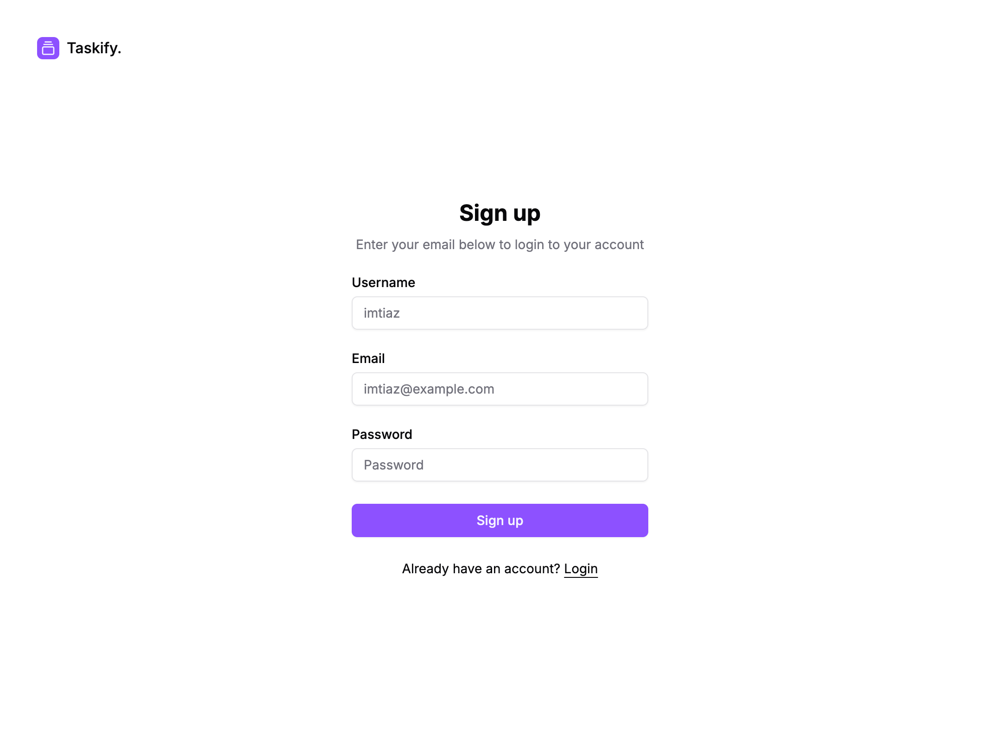

# Taskify - Your Task Management App

Live Link - https://taskify-task-manager-five.vercel.app/

## Project Overview

This **Taskify** project consists of:

1. **Frontend**: **React js** hosted on vercel.
2. **Backend**: Express, Node js hosted on Render, mongoDb for database.

## Installation

#### Prerequisites

- Ensure you have **Node.js** installed (version 18 or higher recommended).

#### Cloning the Repository

- Clone the repository from GitHub:

  ```bash
  git clone https://github.com/iuashrafi/taskify-task-manager.git

  cd taskify-task-manager
  ```

### Backend setup

#### Install the packages

- To install the packages run:
  ```bash
  npm install
  ```

#### Env configuration

Add a .env file to root folder 'backend/'

```bash
PORT=3000
NODE_ENV='development'
MONGO_URL='mongodb://localhost:27017/taskify'
CLIENT_URL='http://localhost:5173'
JWT_SECRET='yourJwtSecret'
```

#### Running the Development Server

- Start the development server using the following command:
  ```bash
  npm run dev
  ```

### Frontend setup

#### Install the packages

- To install the packages run:
  ```bash
  cd frontend/
  npm install
  ```

#### Env configuration

Add a .env file to root folder 'frontend/'

```bash
VITE_API_URL="http://localhost:3000/api"
NODE_ENV="development"
```

#### Running the Development Server

- Start the development server using the following command:
  ```bash
  npm run dev
  ```

## Screenshots

Please check screenshots folder or directly the github link (incase the screenshots doesn't loads locally)

Task Board


Sign up

